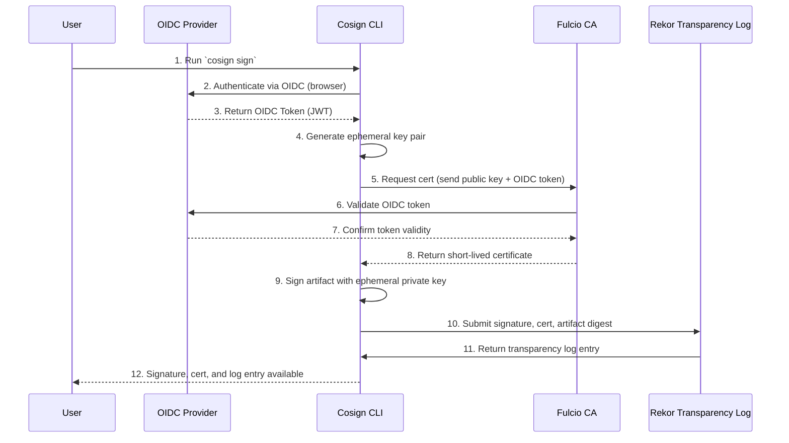
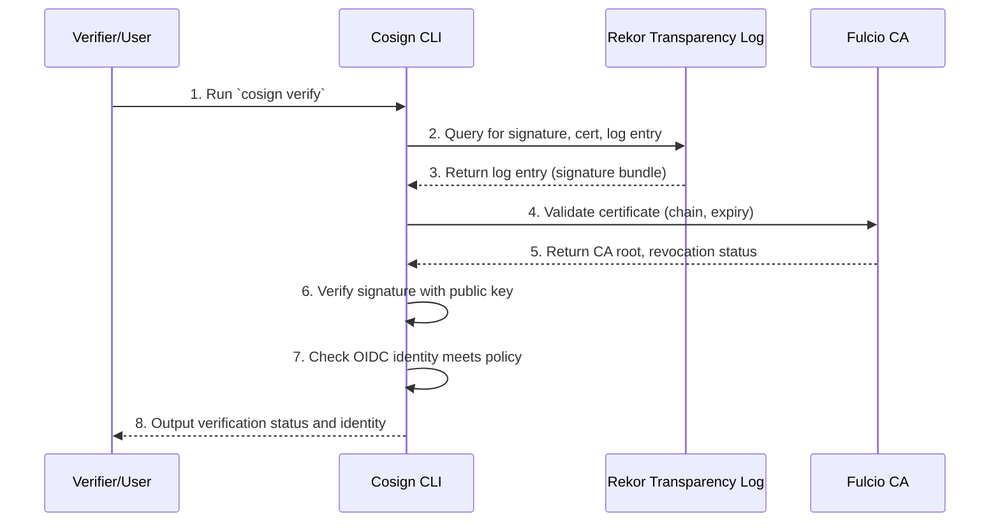
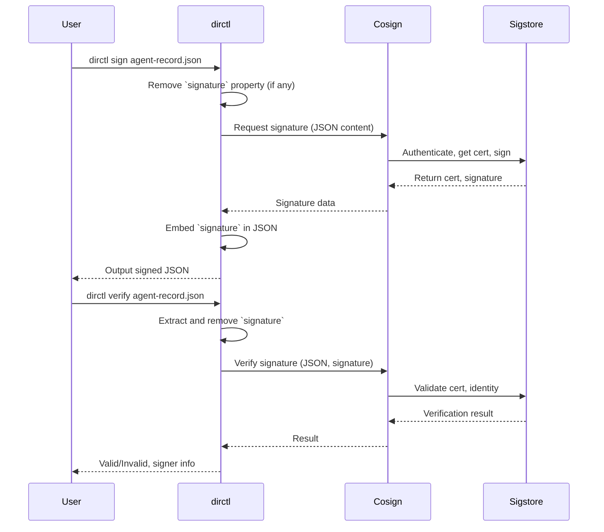

# Signing and Verification

- [Signing and Verification](#signing-and-verification)
  - [Sigstore as a backend for Signing \& Verification](#sigstore-as-a-backend-for-signing--verification)
    - [Signing Process](#signing-process)
      - [High-Level Overview](#high-level-overview)
      - [Detailed Step-by-Step Flow](#detailed-step-by-step-flow)
    - [Verification Process](#verification-process)
      - [High-Level Overview](#high-level-overview-1)
      - [Detailed Step-by-Step Flow](#detailed-step-by-step-flow-1)
    - [Verification Flow](#verification-flow)
    - [API Calls](#api-calls)
      - [Fulcio (Certificate Authority)](#fulcio-certificate-authority)
      - [Rekor (Transparency Log)](#rekor-transparency-log)
      - [OIDC Provider](#oidc-provider)
      - [Summary](#summary)
  - [How Directory performs Signing \& Verification](#how-directory-performs-signing--verification)
    - [Signing Workflow (`dirctl sign`)](#signing-workflow-dirctl-sign)
    - [Verification Workflow (`dirctl verify`)](#verification-workflow-dirctl-verify)
    - [Directory Signing \& Verification](#directory-signing--verification)
  - [Using Other Services Instead of Sigstore](#using-other-services-instead-of-sigstore)
  - [Next steps](#next-steps)

## Sigstore as a backend for Signing & Verification

Sigstore is an open-source suite of services and tools that enables software artifact signing and verification without the need to manage long-lived private keys. The primary Sigstore components are:

- **Cosign**: CLI for artifact signing and verification.
- **Fulcio**: Ephemeral Certificate Authority that issues short-lived certificates.
- **Rekor**: Transparency log for signed metadata.
- **OIDC Provider**: External service that authenticates users (e.g., Google, GitHub).

---

### Signing Process

#### High-Level Overview

1. **User Authentication**  
   The user authenticates via an OIDC provider (e.g., GitHub, Google).

2. **Certificate Request**  
   The user (via Cosign) requests a short-lived signing certificate from Fulcio, presenting the OIDC token.

3. **Signing**  
   Cosign signs the artifact with the ephemeral private key and certificate.

4. **Transparency Log**  
   Cosign submits the signature and certificate to Rekor for transparency and immutability.

#### Detailed Step-by-Step Flow



1. **User runs `cosign sign`**
   - Cosign detects no local private key.
2. **OIDC Authentication**
   - Cosign initiates an OIDC login.
   - User is redirected to the OIDC provider.
   - User authenticates and authorizes Cosign.
   - Cosign receives an OIDC identity token (JWT).
3. **Requesting Certificate from Fulcio**
   - Cosign generates an ephemeral key pair (public/private).
   - Cosign sends a signing certificate request to Fulcio API, authenticating with the OIDC token and including the public key.
   - Fulcio verifies the OIDC token, issues a short-lived certificate binding the public key to the OIDC identity, and returns the certificate.
4. **Artifact Signing**
   - Cosign uses the ephemeral private key to sign the artifact (e.g., container image digest).
   - Cosign creates a signature bundle: `{signature, certificate, artifact digest}`.
5. **Transparency Log Submission (Rekor)**
   - Cosign submits the signature bundle to Rekor via its API.
   - Rekor verifies the certificate, logs the bundle, and returns a log entry (with unique log index/UUID).
   - The log entry provides an immutable, timestamped, and auditable record.

---

### Verification Process

#### High-Level Overview

1. **Fetch Signature and Certificate**  
   The verifier (via Cosign) retrieves the signature, certificate, and Rekor log entry for the artifact.
2. **Transparency Log Verification**  
   Cosign checks that the signature entry exists in Rekor and matches the artifact.
3. **Certificate Validation**  
   Cosign validates the Fulcio certificate (expiry, OIDC identity).
4. **Signature Verification**  
   Cosign verifies the artifact’s signature with the public key from the certificate.
5. **OIDC Identity Check (Optional)**  
   Cosign can enforce policies (e.g., only accept certain identities or issuers).


#### Detailed Step-by-Step Flow

### Verification Flow



1. **User runs `cosign verify`**
   - Cosign determines the location of the signature and certificate (e.g., OCI registry, file, or Rekor log).
2. **Retrieve Signature & Certificate**
   - Cosign fetches the signature and certificate.
3. **Verify in Rekor**
   - Cosign queries Rekor to ensure the signature bundle was submitted and is present in the log.
   - Validates log entry inclusion and integrity.
4. **Certificate Validation**
   - Cosign checks that:
     - The certificate is signed by Fulcio’s root CA.
     - The certificate is not expired or revoked.
     - The OIDC identity in the certificate meets policy.
5. **Verify Signature**
   - Cosign uses the public key in the certificate to verify the artifact’s signature.
6. **Return Verification Result**
   - Cosign outputs pass/fail, identity, and log entry details.

### API Calls

#### Fulcio (Certificate Authority)

- `POST /api/v1/signingCert`
  - Request: `{publicKey, OIDC_token}`
  - Response: `{certificate}`

#### Rekor (Transparency Log)

- `POST /api/v1/log/entries`
  - Submit signature bundle for logging.
- `GET /api/v1/log/entries/{uuid}`
  - Retrieve log entry by UUID.

#### OIDC Provider

- Standard OAuth2/OIDC flows (authorize, token endpoints).

#### Summary

| Step | Component | API/Action | Purpose |
|------|-----------|------------|---------|
| 1    | OIDC      | Auth Flow  | User authentication |
| 2    | Fulcio    | `/signingCert` | Issue ephemeral certificate |
| 3    | Cosign    | -          | Artifact signing |
| 4    | Rekor     | `/log/entries` | Log signature bundle |
| 5    | Cosign    | -          | Verification process |
| 6    | Fulcio    | Cert Chain | Certificate validation |
| 7    | Rekor     | `/log/entries/{uuid}` | Log entry retrieval |

---

## How Directory performs Signing & Verification

### Signing Workflow (`dirctl sign`)

1. **Preparation**  
   - Reads the target agent record JSON file.
   - If a `signature` property is present, it is removed before signing.

2. **Signing using Sigstore**  
   - `dirctl` calls Cosign, which interacts with the Sigstore services:
       - **OIDC Authentication:** Cosign authenticates the user using an OpenID Connect (OIDC) provider (such as GitHub or Google).
       - **Certificate Issuance:** Cosign requests a short-lived signing certificate from Sigstore's Fulcio CA using the OIDC token.
       - **Ephemeral Key Generation:** Cosign generates a one-time-use key pair for signing.
       - **Signature Generation:** Cosign signs the canonicalized agent record JSON with the ephemeral private key and attaches the certificate.
   - The signature data is base64-encoded.

3. **Embedding the Signature**  
   - `dirctl` appends the new `signature` property to the JSON object, containing the Cosign-generated signature (and associated metadata if needed).

4. **Output**
   - The signed JSON (with the embedded signature) is written to the specified output or overwrites the original file.

```json
{
   "name": "directory.agntcy.org/cisco/marketing-strategy",
   "version": "v1.0.0",
   "description": "Research agent for Cisco's marketing strategy.",
   "authors": [
      "Cisco Systems"
   ],
   "created_at": "2025-03-19T17:06:37Z",
   "skills": [
      {
         "category_uid": 1,
         "class_uid": 10201,
         "category_name": "Natural Language Processing",
         "class_name": "Text Completion"
      }
   ],
   "locators": [
      {
         "type": "docker-image",
         "url": "https://ghcr.io/agntcy/marketing-strategy"
      }
   ],
   "signature": {
      "algorithm": "SHA2_256",
      "signature": "<content-signature>",
      "certificate": "<signing-cert>",
      "content_type": "application/vnd.dev.sigstore.bundle.v0.3+json",
      "content_bundle": "<signature-bundle>",
      "signed_at": "2025-06-06T18:06:04-07:00"
   }
}
```

---

### Verification Workflow (`dirctl verify`)

1. **Preparation**  
   - Reads the agent record JSON file.
   - Extracts and removes the `signature` property.

2. **Verifying using Sigstore**  
   - `dirctl verify` calls Cosign to verify the signature:
       - **Signature Validation:** Cosign verifies the signature against the unsigned JSON agent record.
       - **Certificate & Identity Check:** Cosign validates the Fulcio certificate, OIDC identity, and (optionally) Rekor transparency log entry.

3. **Result**  
   - Reports whether the signature is valid and, if so, the identity of the signer.

---

### Directory Signing & Verification



---

## Using Other Services Instead of Sigstore

While Sigstore (via Cosign) is the default signing backend for `dirctl`, the tool can be extended to support other signing and verification services. This typically involves:

- **Signature schema:**
  The signature schema is generic which allows support for embedding the signature and verification bundles from other services.
- **Replacing Cosign Integration:**  
  Swap out Cosign for another signing tool or library (e.g., GPG, X.509 PKI, KMS-backed signers).
- **Signature Handling:**  
  Ensure that only the desired fields are signed (excluding `signature`), and the resulting signature is embedded as a property in the JSON object.
  Agent records carry signature data as part of the schema,
  enabling verification even as the record schema drifts.
- **Verification:**  
  The verification routine should extract and remove the `signature` before checking, and use the corresponding public key or certificate.

## Next steps

- Add support for new signing and verification backends
- Store signature separately from the Agent Record
